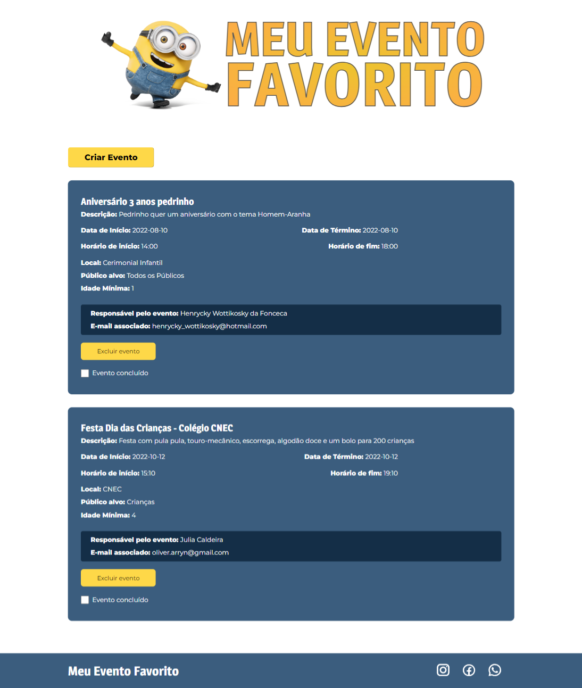

<div id="top"></div>

<br />
<div align="center">
  <a href="https://github.com/othneildrew/Best-README-Template">
    
  </a>

<h3 align="center">Gerenciando seus Eventos Favoritos</h3>

  <p align="center">
  </p>
    <div align="center">
    
  </div>
</div>

  <h1><summary>Sumário</summary></h1>
  <ol>
    <li><a href="#sobre-o-projeto">Sobre o Projeto</a></li>
    <li><a href="#feito-com">Feito com</a></li>
    <li><a href="#comecando">Começando</a></li>
    <li><a href="#pre-requisitos">Pré-Requisitos</a></li>
    <li><a href="#instalacao">Instalação</a></li>
    <li><a href="#exemplos-de-uso">Exemplos de uso</a></li>
    <li><a href="#contribuindo">Contribuindo</a></li>
    <li><a href="#licenca">Licença</a></li>
    <li><a href="#contato">Contato</a></li>
    <li><a href="#ferramentas-adicionais">Ferramentas adicionais</a></li>
    <li><a href="#consideracoes-finais">Considerações Finais</a></li>
  </ol>


<div id="sobre-o-projeto"> </div>

## ✏️ Sobre o projeto

O Meu Evento Favorito é um sistema que foi pensado e desenvolvido com o intuito de auxiliar criadores de eventos com uma visualização prática de gerenciamento.


Foi desenvolvido na disciplina de Projeto Integrado, que é uma matéria para os alunos de Ciência da Computação na UFES - Universidade Federal do Espírito Santo, no Brasil.

Algumas coisas que você pode fazer:
* Criar seu evento
* Inserir as informações
* Excluir o evento
* Marcar como concluído


<div id="feito-com"> </div>

### 🔨 Feito com

Aqui estão algumas linguagens, frameworks, ferramentas e bibliotecas que usamos no desenvolvimento dessa aplicação:

* [ReactJs](https://reactjs.org/)
* [NextJs](https://nextjs.org/)
* [Typescript](https://www.typescriptlang.org/)
* [SASS](https://sass-lang.com/)
    

<div id="comecando"> </div>

## 🔛 Começando

Aqui estão algumas instruções sobre como configurar o projeto localmente. Para obter uma cópia local, siga os passos abaixo:

<div id="pre-requisitos"> </div>

### Pré-requisitos

Todas as ferramentas que você precisa ter instalado para rodar o projeto e as suas versões
* [NodeJs - v16.16.0](https://nodejs.org/en/download/)
* [Yarn - v1.22.18](https://yarnpkg.com/)

Se você pretende rodar esse projeto localmente, você precisa pesquisar como instalar todos essas ferramentas para o seu sistema operacional, e pode encontrar todas essas informações nos seus devidos sites oficiais.

<div id="instalacao"> </div>

## 👨‍💻 Instalação

Clone o repositório
```sh
git clone https://github.com/HenryWotti/Meu-Evento-Favorito
```

### Inicializando Front-end
```bash
  # Entre na pasta frontend
  $ cd frontend
  # Instale as dependencias:
  $ yarn
  # Para rodar a aplicação em modo de desenvolvimento:
  $ yarn dev
```

<div id="contribuindo"> </div>

## 💻 Exemplos de uso

Alguns exemplos de uso da nossa aplicação são:
* Registro de eventos com informações detalhadas.
* Visualização dos eventos cadastrados.
* Persistência dos dados referentes aos eventos cadastrados.
* Alteração de status dos eventos para não concluído/concluído.
* Exclusão permanente de eventos.

## 🙌 Contribuindo

Se você tem alguma sugestão que fará este app ficar melhor, por favor realize um fork e crie um Pull Request. Você pode também simplesmente abrir uma issue com a tag "enhancement" para sugestões e "error" para problemas enfrentados

1. Faça um fork do Projeto
2. Crie seu branch da Feature (`git checkout -b feature/AmazingFeature`)
3. Faça commit das suas modificações (`git commit -m 'Add some AmazingFeature'`)
4. Faça um push para o branc (`git push origin feature/AmazingFeature`)
5. Abra um Pull Request


<div id="licenca"> </div>

## 📋 Licença

Distribuído na Licença MIT.


<div id="contato"> </div>

## ✉️ Contato

Henrycky Wottikosky da Fonceca - henrycky_wottikosky@hotmail.com

Julia Caldeira Mendonça - j.caldeira.j@gmail.com

Gustavo Brunoro Nahuz - gustavobrunoronahuz@gmail.com

<div id="ferramentas-adicionais"> </div>

## 🔧 Ferramentas adicionais

Ferramentas adicionais que recomendamos para desenvolvimento

* [Visual Studio Code](https://code.visualstudio.com/)
* [WebStorm](https://www.jetbrains.com/pt-br/webstorm/)

## 🎓 Considerações Finais

<div id="consideracoes-finais"> </div>

Durante a codificação do projeto, desenvolvemos habilidade com o Next.JS e trabalhamos para implementar funcionalidades da ideia inicial. À medida que o trabalho evoluia, enfrentamos dificuldades, e uma funcionalidade que gostaríamos de ter implementado, que foi a edição de um evento pelo usuário que o cadastrou não foi concluída, uma vez que não conseguimos manipular objetos criados em diferentes páginas por usuários específicos dentro do prazo. Outro contratempo foi a integração do backend (NodeJs) com a aplicação, assim foi decidido usar a API do google "Firebase - firestore storage" para guardamos os dados não somente de forma local, mas em um banco de dados. Ao final, produzimos as funcionalidades e documentamos o projeto.

<p align="right">(<a href="#top">Voltar ao topo</a>)</p>
